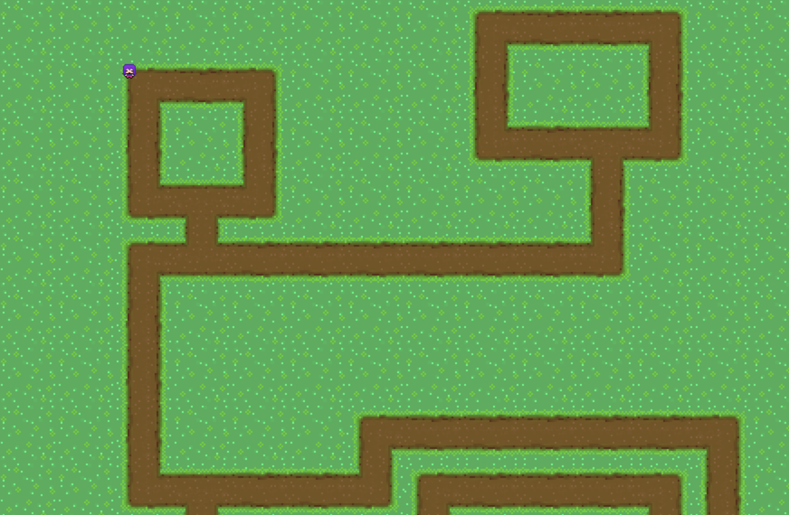

# Ms. Pajamas Game Engine

This engine aims to simplify and expidite building top-down GBA-era RPGs.

## Description

This engine focuses on streamlining the process of creating a top-down tile-based RPG through worldbuilding tools and simple scene management.

The engine uses an Entity-Component System (ECS) for managing objects and components in the game.

Users can write their own scripts in Python and use them in the engine by instantiating them as a `BehaviorComponent`. These components are built within the entity-component framework, so they act identical to predefined components.

The engine ships with a world-editor application for creating and editing tile maps for use in the game. The editor provides tools for painting tiles from a [texture atlas](https://en.wikipedia.org/wiki/Texture_atlas) onto the tile map, erasing tiles, and painting colliders on tiles. See [Using the Paintbrush Editor](#using-the-paintbrush) for more info.

## Installation and Setup

When compiling the project for yourself, you will need to follow the steps below. Otherwise, if you are using the [precompiled Python library](TODO_LINK_HERE), skip to [Using the Engine](#using-the-engine).

### Dependencies

#### pybind11

This engine uses [pybind11](https://github.com/pybind/pybind11) to export the optimized C++ engine to be used in Python for easy scripting.

For more detailed installation instructions, see [pybind11 — Installing the library](https://pybind11.readthedocs.io/en/stable/installing.html).

##### Install with brew (Mac and Linux/Unix only)

```sh
brew install pybind11
```

##### Install with Pip

```sh
pip install pybind11
```

#### SDL (and Extensions)

This engine uses [SDL](https://www.libsdl.org) for cross-platform development. SDL allows us to create windows, display 2D graphics, play audio, and collect user input, so that we can focus on developing features of the engine.

The installation of SDL is less streamlined than pybind11. The [SDL Wiki](https://wiki.libsdl.org/SDL2/Installation) explains how to compile the core library on all supported platforms. However, we recommend following [Mike Shah](https://www.youtube.com/@MikeShah)'s tutorials on installing the precompiled binaries on [Windows](https://www.youtube.com/watch?v=DQ-NBjBFLJ4&t=7s), [Mac](https://www.youtube.com/watch?v=V6ACATpl2LQ), and [Linux/Unix](https://www.youtube.com/watch?v=P3_xhDIP7bc) respectively.

You will also need to install the following extensions of SDL to finish the setup process:

- [SDL_image](https://github.com/libsdl-org/SDL_image/releases) — Adds support for decoding common image file formats
- [SDL_ttf](https://github.com/libsdl-org/SDL_ttf/releases) — Adds support for rendering text on the screen using true type fonts (ttf)

### Compilation

The project comes with a Makefile that should work on Windows, Mac, and Linux/Unix.

> **Note:**
> *If you would like to compile your own binary with an older version of Python (^3.6), specify by setting the Makefile variable `PY=python3.X`.*

#### For Mac and Linux/Unix users

Navigate to the project folder with the Makefile. The following `make` directive will compile the engine into a Python library (`mspj_engine.so`):

```sh
make pybind
```

The following `make` directive will compile the tile map paintbrush editor executable (`mspj-paintbrush-editor`):

```sh
make paintbrush
```

#### For Windows Users

Navigate to the project folder with the Makefile. The following `make` directive will compile the engine into a Python library (`mspj_engine.so`):

```sh
mingw32-make.exe pybind
```

The following `make` directive will compile the tile map paintbrush editor executable (`mspj-paintbrush-editor`):

```sh
mingw32-make.exe paintbrush
```

#### Installation

The `mspj_engine.so` Python library can be used locally in a Python project or installed globally for use across projects. For instructions on installing the local library for global use, [see Python's Installing Packages](https://packaging.python.org/en/latest/tutorials/installing-packages/#installing-from-local-archives).

The tile map paintbrush editor can be used locally or installed globally as well.

##### On Mac and Linux/Unix

First, navigate to the folder containing the executable. Second, add executable permissions to the exectuable file: 

```sh
chmod +x ./mspj-paintbrush-editor
```

Third, copy the executable into your local bin folder. You may have to `sudo` and provide an admin password to complete this action.

```sh
cp ./mspj-paintbrush-editor /usr/local/bin
```

Finally, confirm that the installation was successful by navigating to any other folder and attempting to run the following command:

```sh
mspj-paintbrush-editor
```

##### On Windows

Rather than moving the executable to a specific folder on your machine, you can use the program anywhere by adding it to your `PATH` environment variable. Follow [this guide](https://medium.com/@kevinmarkvi/how-to-add-executables-to-your-path-in-windows-5ffa4ce61a53) on how to edit your environment variables and add the program to your `PATH`.

## Using the Engine

The following example game can be found at [helloWorld.py](./helloWorld.py).

```python
import mspj_engine

engine = mspj_engine.Engine();

# Initialize the Engine Subsystems
engine.InitializeGraphicsSubSystem();
engine.InitializeInputSystem();
# Once all subsystems have been initialized
# Start the engine
engine.Start();

# ------- all scene setup should happen after this line -------

# Load the texture atlas for the tilemap
engine.LoadTextureAtlas("./images/character-sprite/path/path-sheet.bmp", 32, 32);

# Setup our TileMap
tileMapObject = engine.InstantiateGameObject();
tileMapComponent = engine.InstantiateTileMapComponent(tileMapObject);
# Each 32x32 tile is scaled up to 64x64 pixels.
tileMapComponent.SetDisplayTileSize(64, 64);
# This example tile map is 20x11 in our game.
tileMapComponent.GenerateMapFromFile("./tilemap-levels/level1");
# Print out the map to the console
# so we can see what was created.
tileMapComponent.PrintMap();

# Note: Player must be created after the tilemap to be rendered after (above) the tilemap
# Create our player game object, all components created here
# are to be deleted by the Player
player = engine.InstantiateGameObject();
# Prepare the controller
controller = engine.InstantiateControllerComponent(player);
player.GetTransform().SetPosition(128, 64);
# Prepare the sprite
sprite = engine.InstantiateSpriteRendererComponent(player);
sprite.LoadImage("./images/character-sprite/walk-cycle/character-walk-spritesheet.bmp");

# ------- all scene setup should finish before this line -------

# Run our program forever
engine.MainGameLoop();

# Explicitly call Shutdown to terminate our engine
engine.Shutdown();
```

### Running the game

Run the [helloWorld.py](./helloWorld.py) script as you would any other Python script. 

> **Note:**
> *The Python library binary requires a Python version of 3.11 or greater. You may have to specify the specific python version when trying to run the script:*
>
> ```sh
> python3.11 ./helloWorld.py
> ```

To run this example game, run the Python script like so:

```sh
python ./helloWorld.py
```

### Result

A game screen should appear with a forest scene and purple-haired player character that can walk around the world.



### Troubleshooting

If you run into any errors that prevent the game from launching:

1. Ensure that the compiled Python library (`mspj_engine.so`) is in the same directory as the Python script.
2. Ensure that the name of the import (`import mspj_engine`) matches the name of the Python library (without the extension).
3. Specify a Python version to use (`^3.6`) by calling it directly: `python3.11 ./helloWorld.py`.

## Using the Paintbrush Editor

**-- THIS FEATURE IS IN DEVELOPMENT --**

## Credits

The [Ms. Pajamas Game Engine](#ms-pajamas-game-engine) was created by Marvin Chong, Samik Mathur, Phi Garcia, and Jake Pine. The name of the engine comes from the combination of first initials of all team members (MSPJ's engine).

Additional credit to [Mike Shah](https://www.youtube.com/@MikeShah) for his excellent instruction, and Robert Nystrom's *[Game Programming Patterns](https://gameprogrammingpatterns.com)* book for architecture inspiration and coding examples.
